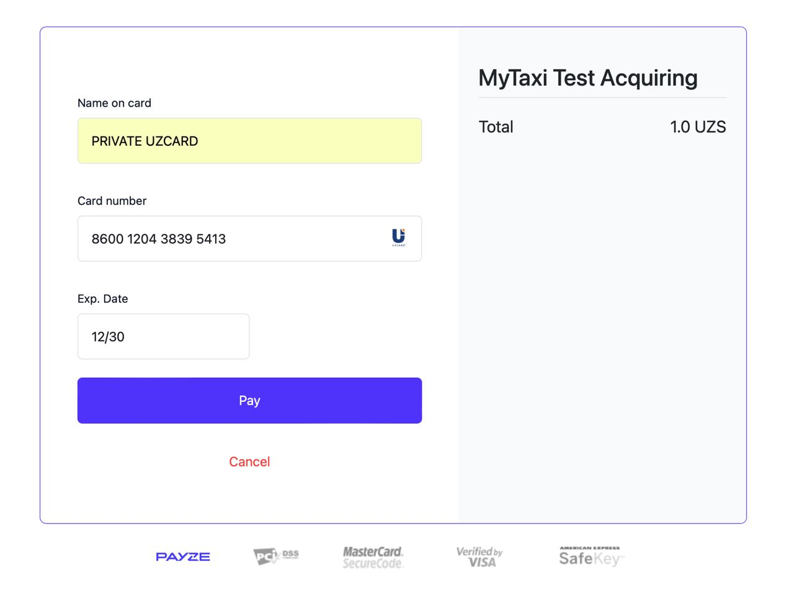
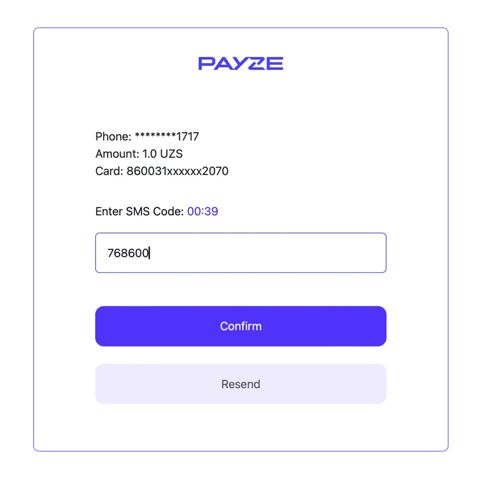
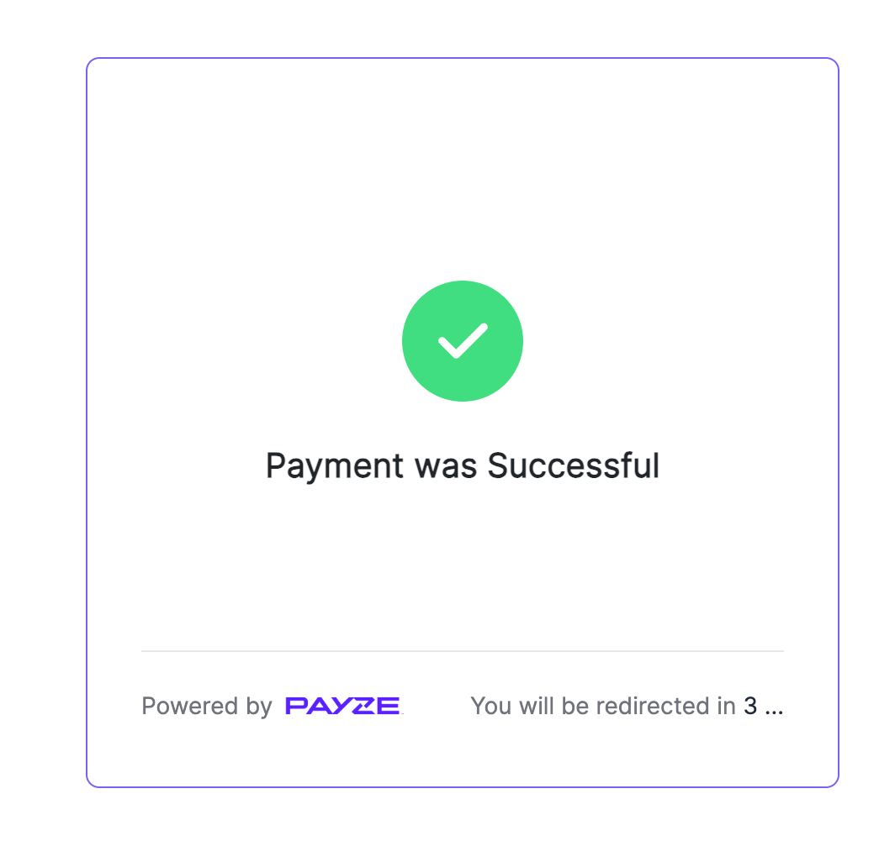

# Payze Uzbekistan implementation.

Support Group - <a href="https://t.me/+Ng1axYLNyBAyYTRi">Telegram</a> <br/>

## Installation

```shell
pip install payze-pkg
```

## Payze PKG
- [JustPay](#justpay)
# Methods

## JustPay

```python
from payze.client import Payze
from payze.param import PayzeOPS
from payze.param import request as payze_req


payze = Payze(
    ops=PayzeOPS(
        url="https://payze.io",
        auth_token="get-your-auth-token-from-payze",
        hooks=payze_req.Hooks(
            web_hook_gateway="https://mysite.com/v1/webhook/payze/success",
            error_redirect_gateway="https://mysite.com/v1/payment/payze/re-pay",
            success_redirect_gateway="https://mysite.com/v1/payment/payze/thanks",
        )
    )
)

metadata = payze_req.Metadata(
    order=payze_req.Order(123),
)

req_params = payze_req.JustPay(
    amount=1,
    metadata=metadata,
)

# any kwarg fields are optional and can be extra attribute
resp = payze.just_pay(
    req_params=req_params,
    reason="for_trip",  # extra attribute example
)

print(resp.data.payment.payment_url)
```
# Payment process at Payze

## Insert card for payment:



## Confirm payment button:



## Payment was successfully:


<p float="left">
  
   
  
</p>

##


